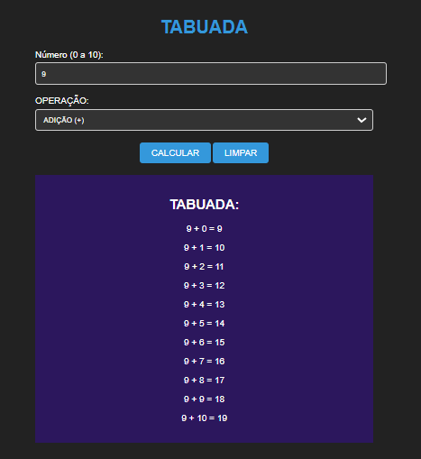

# TABUADA BASICA
🆎TABUADA BASICA EM HTML, CSS E JS.

  

## DESCRIÇÃO:
Este projeto consiste em uma calculadora de tabuada que permite ao usuário visualizar a tabuada de adição, subtração, multiplicação ou divisão de um número específico entre 0 e 10. Aqui estão as principais funcionalidades implementadas:

1. Entrada de Número:
   - O usuário pode inserir um número entre 0 e 10 no campo "Número".

2. Seleção de Operação:
   - Através do menu suspenso "OPERAÇÃO", o usuário pode escolher entre adição (+), subtração (-), multiplicação (*) ou divisão (/).

3. Cálculo da Tabuada:
   - Ao clicar no botão "CALCULAR", a tabuada correspondente ao número e à operação selecionados é exibida abaixo do botão.

4. Limpar:
   - O botão "LIMPAR" permite ao usuário limpar o campo de número, redefinir a operação para adição e ocultar a tabuada.

## EXECUTANDO O PROJETO:
1. Digitar Número:
   - Insira um número entre 0 e 10 no campo "Número".

2. Selecionar Operação:
   - Escolha a operação desejada (adição, subtração, multiplicação ou divisão) no menu suspenso "OPERAÇÃO".

3. Calcular Tabuada:
   - Clique no botão "CALCULAR" para visualizar a tabuada correspondente.

4. Limpar Campos:
   - Se desejar limpar o campo de número e redefinir a operação para adição, clique no botão "LIMPAR".
   - Isso ocultará a tabuada da tela.

## NÃO SABE?
- Entendemos que para manipular arquivos em `HTML`, `CSS` e outras linguagens relacionadas, é necessário possuir conhecimento nessas áreas. Para auxiliar nesse aprendizado, oferecemos cursos gratuitos disponíveis:
* [CURSO DE HTML E CSS](https://github.com/VILHALVA/CURSO-DE-HTML-E-CSS)
* [CURSO DE JAVASCRIPT](https://github.com/VILHALVA/CURSO-DE-JAVASCRIPT)
* [CONFIRA MAIS CURSOS](https://github.com/VILHALVA?tab=repositories&q=+topic:CURSO)

## CREDITOS:
- [PROJETO CRIADO PELO VILHALVA](https://github.com/VILHALVA)
- [ESTÁ DISPONIVEL NO SITE](https://vilhalva.github.io/STYLER/STYLER.html)

